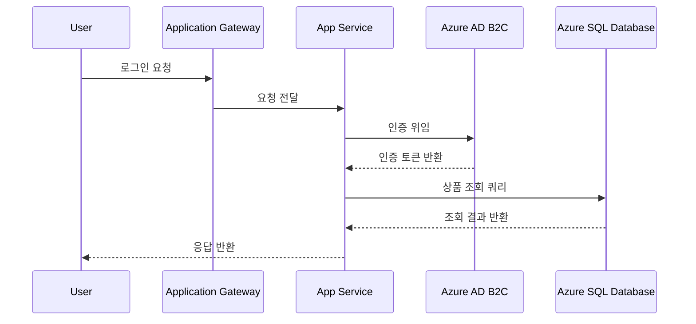

# Section 6. 아키텍처 문서 자동 생성

## 학습 목표
- HLD(High-Level Design) 문서의 작성 방식과 구성요소를 이해한다.
- Mermaid-AI를 활용해 Infra Diagram과 Sequence Diagram을 자동 생성할 수 있다.
- Use Case 입력으로부터 아키텍처 다이어그램을 생성할 수 있다.

## HLD(High-Level Design) 작성 방식
HLD는 시스템 전체 구조를 이해관계자가 빠르게 파악하도록 돕는 상위 수준 설계 문서.

### 핵심 구성요소
- 시스템 개요, 아키텍처 다이어그램, 주요 컴포넌트 역할, 데이터 흐름, 비기능 요구사항(성능/보안/가용성)
- **좋은 HLD의 조건**: 비개발자도 이해 가능한 수준의 추상화, 다이어그램과 텍스트의 상호 보완

### HLD 표준 목차
1. 개요
2. 아키텍처 다이어그램
3. 컴포넌트 설명
4. 데이터 흐름
5. 보안/가용성 고려사항
6. 용어집

### HLD vs LLD
| 항목 | HLD (상위설계) | LLD (상세설계) |
|------|---------------|---------------|
| 목적 | 전체 구조 이해 | 구현 상세 정의 |
| 대상 독자 | 경영진·이해관계자·아키텍트 | 개발자·엔지니어 |
| 포함 내용 | 아키텍처 다이어그램, 데이터 흐름 | API 명세, 스키마, 알고리즘 |
| 변경 빈도 | 낮음 | 상대적으로 높음 |
| 초점 | '무엇을·왜' | '어떻게(구현 상세)' |

### 문서 자동화 흐름
```
Use Case 입력 → Mermaid-AI → HLD 초안 → Infra Diagram → Sequence Diagram → 검토 및 배포
```

## Infra / Sequence Diagram 자동 생성
**Mermaid-AI**는 텍스트 기반 설명을 다이어그램 문법(Mermaid syntax)으로 변환하는 도구.

- **Infra Diagram**: 구성요소(VNet, VM, DB 등)와 연결 관계를 노드·엣지로 표현
- **Sequence Diagram**: 사용자 요청 → 응답까지 컴포넌트 간 호출 순서·시간 흐름 표현
- **Mermaid 문법**: `graph TD`(플로우차트), `sequenceDiagram`(시퀀스) 등 각 노드에 서비스명·역할 라벨링
- **유지보수 이점**: 텍스트 기반이라 Git으로 버전 관리 가능, 아키텍처 변경 시 함께 업데이트 용이

> **실무 팁**: 다이어그램은 한 화면에 **15개 노드 이내**로 제한해야 가독성 유지.

## Use Case → 다이어그램 생성 절차
1. **Use Case 서술**: '사용자가 로그인 후 상품을 주문한다'처럼 행위 중심으로 단계 작성
2. **Mermaid-AI 프롬프트 작성**: 각 단계에 관여하는 Azure 서비스와 순서 명시
3. **생성 및 검토**: 생성된 Mermaid 코드를 렌더링하여 누락된 컴포넌트 확인
4. **문서 통합**: 생성된 다이어그램을 HLD에 삽입하고 텍스트 설명 보완

## Mermaid Sequence Diagram 예시
> GitHub은 아래 코드블록을 자동으로 다이어그램으로 렌더링합니다.



*출처: Mermaid 공식 문서(mermaid.js.org) 문법 기준*

## 실습 Lab
> 🧪 CLI 핸즈온: [해당 실습 바로가기](../labs/day2-labs.md#lab-6--아키텍처-문서-자동-생성)

- **시나리오**: 로그인 → 상품 조회 → 주문 생성 Use Case에 대한 Sequence Diagram을 Mermaid-AI로 생성
- **프롬프트 예시**:
  > "다음 Use Case를 Mermaid sequenceDiagram 문법으로 작성해줘: 사용자가 Application Gateway를 통해 로그인 요청을 보내고, App Service가 Azure AD B2C로 인증을 위임하며, 인증 성공 후 상품 조회 API를 호출하고 Azure SQL Database에서 데이터를 조회한 뒤 응답을 반환한다."
- **점검 포인트**: 모든 컴포넌트 순서 포함 여부 · 호출 방향(요청/응답) 정확성 · 실제 흐름과 일치 여부

## 핵심 요약
- **HLD**: 시스템 전체 구조를 상위 수준으로 설명하는 핵심 문서
- **Infra/Sequence Diagram**: 구조와 흐름을 각각 시각화하는 두 축
- **Mermaid-AI**: 텍스트를 다이어그램으로 자동 변환, 버전 관리 용이
- **Use Case 기반 생성**: 시나리오 서술만으로 다이어그램 초안 확보
- **문서 통합**: 생성된 다이어그램은 반드시 HLD에 통합하고 검토

## 공식문서
- [Azure Architecture Center](https://learn.microsoft.com/en-us/azure/architecture/browse/)
- [Azure 애플리케이션 10가지 설계 원칙](https://learn.microsoft.com/en-us/azure/architecture/guide/design-principles/)
- [Mermaid 공식 문서](https://mermaid.js.org)
