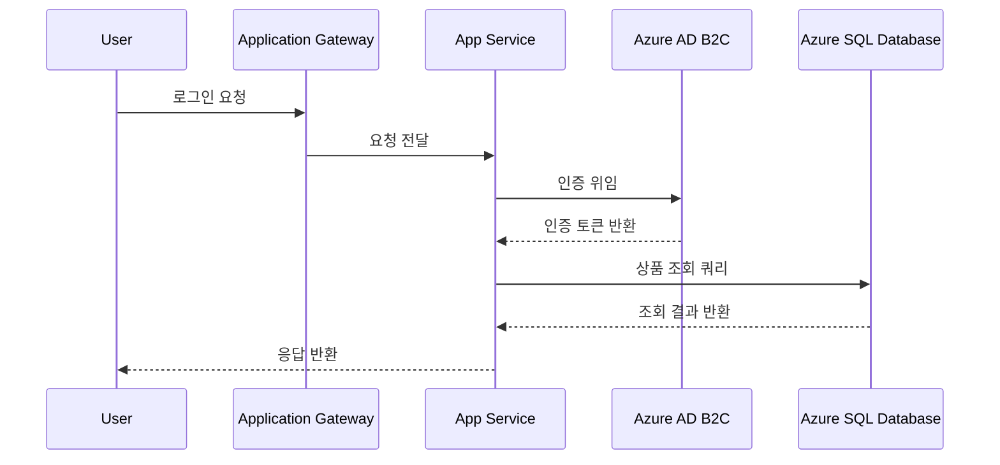

# Day 2 실습 — 검증·문서화·운영 (Lab 5~8)

> 대응 이론: [Chapter 2](../ch2-verification-ops/) · 먼저 [Lab 0 → Day 2 추가 환경](./lab-00-setup.md#day-2-추가-환경-lab-58-시작-전)을 완료하세요.
> 사용 도구: Azure Cloud Shell · Azure Portal · ChatGPT/Gemini · [Mermaid Live](https://mermaid.live)

Day 2는 **"운영 중인 서비스를 관측·검증·최적화한다"** 시나리오입니다. Lab 0에서 띄운 App Service + Application Insights를 관측 대상으로 사용합니다.

---

## Lab 5 — 클라우드 아키텍처 검증
> 이론: [Section 5](../ch2-verification-ops/05-architecture-verification.md)
> **목표**: Advisor·Well-Architected 체크리스트로 환경을 점검하고, AI로 안티패턴 진단.

### Task 1. Azure Advisor 권장사항 조회
```bash
az advisor recommendation list --output table
az advisor recommendation list --category Security --output table
az advisor recommendation list --category Cost --output table
az advisor recommendation list --category Reliability --output table
```

### Task 2. Defender for Cloud 보안 점수
Portal → **Microsoft Defender for Cloud** → 보안 점수(Secure Score) 확인. CLI:
```bash
az security secure-scores list --output table
```
점수를 낮추는 상위 권장사항 3개 메모.

### Task 3. Well-Architected 5대 기둥 체크리스트
Day 1에서 만든 아키텍처 기준으로 직접 채웁니다.

| 기둥 | 점검 항목 | 현재 상태 | 근거(Evidence) |
|------|----------|----------|----------------|
| 안정성 | 단일 장애점(SPOF)이 없는가? | | |
| 보안 | NSG에 0.0.0.0/0 허용 규칙이 없는가? | | |
| 성능 효율성 | Auto-scale이 설정되어 있는가? | | |
| 비용 최적화 | 예약 인스턴스/유휴 리소스 점검이 되어 있는가? | | |
| 운영 우수성 | 모니터링·알림 체계가 구축되어 있는가? | | |

> ✅ "예/아니오"만이 아니라 **근거(리소스 이름, 명령어 출력, 스크린샷)** 를 함께 기록해야 감사(Audit)에서 쓸 수 있는 문서가 됩니다.

### Task 4. GenAI Before/After — 안티패턴 진단
```
# Before
내 Azure 아키텍처가 괜찮은지 봐줘

# After (Section 5 실습과 동일)
다음 Azure 아키텍처를 Well-Architected Framework 5대 기둥 기준으로
검토해줘: 단일 VM(D2s v5) 1대에서 웹서버 운영, 백업 미설정 Azure SQL
Database 1대, 모든 NSG 규칙이 0.0.0.0/0 허용. 발견된 리스크와 개선안을
영향도 순으로 정리해줘.
```
- [ ] 안정성(SPOF)·보안(개방 규칙)·운영(백업 미설정) 리스크 모두 식별
- [ ] 개선안이 영향도·난이도 기준 우선순위화
- [ ] 즉시 조치 항목(보안) 명확히 구분

> 💡 AI가 제시한 리스크는 반드시 실제 구성(`az network nsg rule list` 등)과 교차 검증 — "오탐(False Positive) 가능성" 원칙.

### ✅ Lab 5 완료 확인
- [ ] Advisor 권장사항 카테고리별 조회
- [ ] Defender for Cloud 보안 점수 확인
- [ ] Well-Architected 체크리스트를 근거와 함께 작성
- [ ] 모호 vs 구체 질문의 진단 품질 차이 비교

---

## Lab 6 — 아키텍처 문서 자동 생성
> 이론: [Section 6](../ch2-verification-ops/06-doc-automation.md)
> **목표**: Mermaid-AI로 Sequence/Infra Diagram 생성, HLD 문서 초안 완성.

### Task 1. Use Case → Sequence Diagram
```
다음 Use Case를 Mermaid sequenceDiagram 문법으로 작성해줘: 사용자가
Application Gateway를 통해 로그인 요청을 보내고, App Service가
Azure AD B2C로 인증을 위임하며, 인증 성공 후 상품 조회 API를 호출하고
Azure SQL Database에서 데이터를 조회한 뒤 응답을 반환한다.
```
참고 출력 형태:

> ✅ 4개 컴포넌트가 순서대로 포함되고, 호출(`->>`)·응답(`-->>`) 화살표 방향이 반대가 아닌지 확인.

### Task 2. 전체 아키텍처 → Infra Diagram
```
Day 1에서 구성한 Azure 아키텍처(VNet 내 Web/App/Data Subnet, NSG,
VMSS, Blob Storage, Azure SQL Database)를 Mermaid graph TD 문법의
Infra Diagram으로 그려줘. 각 노드에 서비스명을 라벨로 표시해줘.
```
> 💡 노드 15개 초과 시 가독성 급락 → "Web Tier", "Data Tier"처럼 그룹으로 묶어 재요청.

### Task 3. HLD 문서 초안 (노션 업로드용)
표준 목차에 맞춰 작성하고, Task 1·2 다이어그램을 삽입:
```markdown
# [서비스명] 아키텍처 설계 문서 (HLD)
## 1. 개요            — 서비스 목적, 대상 사용자, 핵심 비기능 요구사항
## 2. 아키텍처 다이어그램  — (Task 2 Infra Diagram 삽입)
## 3. 컴포넌트 설명      — 컴포넌트 | 역할 | 비고 표
## 4. 데이터 흐름        — (Task 1 Sequence Diagram 삽입)
## 5. 보안/가용성 고려사항 — NSG 정책, Multi-AZ, DR 전략
## 6. 용어집
```
> 💡 Mermaid 코드를 그대로 문서에 넣으면(이미지 대신) Git/노션에서 버전 관리가 쉽고, 코드만 수정하면 다이어그램이 함께 갱신됩니다.

### ✅ Lab 6 완료 확인
- [ ] Sequence Diagram이 4개 컴포넌트를 순서대로 포함해 렌더링
- [ ] Infra Diagram이 15개 노드 이내로 가독성 있게 생성
- [ ] HLD 초안이 표준 목차 6개 항목 모두 포함

---

## Lab 7 — 운영·모니터링 구조 설계
> 이론: [Section 7](../ch2-verification-ops/07-monitoring.md)
> **목표**: App Insights·Log Analytics로 실제 트래픽을 관측하고 KPI 기반 Alert 구성.

### Task 1. 관측 대상에 트래픽 발생
```bash
for i in $(seq 1 20); do
  curl -s -o /dev/null -w "%{http_code}\n" https://webapp-lab-$USER.azurewebsites.net
  sleep 1
done
```
> 💡 App Insights는 수집 후 대시보드 반영까지 2~5분 지연 가능.

### Task 2. Log Analytics에서 KQL 조회
Portal → `appi-lab` > **로그(Logs)**:
```kusto
requests
| where timestamp > ago(1h)
| summarize RequestCount = count(), AvgDuration = avg(duration) by bin(timestamp, 5m)
| render timechart
```
CLI로도 조회:
```bash
WORKSPACE_ID=$(az monitor log-analytics workspace show \
  --resource-group $USER-rg --workspace-name law-lab --query customerId -o tsv)
az monitor log-analytics query --workspace $WORKSPACE_ID \
  --analytics-query "requests | take 10" --output table
```

### Task 3. CPU 기준 Alert Rule 생성
```bash
PLAN_ID=$(az appservice plan show --name plan-lab-web --resource-group $USER-rg --query id -o tsv)

az monitor metrics alert create --name alert-cpu-high --resource-group $USER-rg \
  --scopes $PLAN_ID --condition "avg CpuPercentage > 70" \
  --window-size 5m --evaluation-frequency 1m --severity 2
```
> 💡 운영 환경에서는 `--action`으로 Action Group(이메일/Teams/Webhook)을 연결해 알림 수신. 실습은 규칙 생성 구조에 집중.

### Task 4. GenAI Before/After — 모니터링 정책 설계
```
Azure App Service로 운영되는 API 서비스의 목표가 P95 응답시간
500ms 이내, 가용성 99.9%다. Azure Monitor 기반으로 추적해야 할
핵심 메트릭과 Alert Rule 임계값, 로그 보존 기간을 제안해줘.
```
- [ ] 제안 메트릭이 가용성·성능 목표 모두 커버
- [ ] Alert 임계값 민감/둔감 여부
- [ ] 로그 보존 기간 컴플라이언스 충족(기본 30일, 최대 2년)

### ✅ Lab 7 완료 확인
- [ ] 발생 트래픽이 `requests` 테이블에서 조회됨
- [ ] KQL로 요청 수·평균 응답시간 추이 확인
- [ ] `alert-cpu-high` 생성
- [ ] 제안 정책과 우리 설정 비교

---

## Lab 8 — 운영 최적화 자동화
> 이론: [Section 8](../ch2-verification-ops/08-ops-optimization.md)
> **목표**: KQL 이상 탐지 쿼리 작성, AI로 장애 원인 분석, 포스트모템 작성. 전체 과정 마무리.

### Task 1. KQL 이상 탐지 쿼리
```kusto
// 지난 1시간 5xx 에러 급증 탐지
requests
| where timestamp > ago(1h)
| where resultCode startswith "5"
| summarize ErrorCount = count() by bin(timestamp, 5m)
| where ErrorCount > 50

// P95 응답시간 추이
requests
| where timestamp > ago(24h)
| summarize P95 = percentile(duration, 95) by bin(timestamp, 1h)
| render timechart
```
> 💡 실습 환경엔 5xx가 거의 없어 첫 쿼리 결과가 비어 있는 것이 정상. 실무에서는 이 쿼리를 Log Alert Rule로 스케줄링해 자동 경보화.

### Task 2. GenAI Before/After — 장애 원인 분석
```
# Before
API가 느려졌어. 왜 그런거야?

# After (Section 8 실습과 동일)
Azure App Service 기반 API의 P95 응답시간이 평소 500ms에서 특정
30분 동안 3초로 급증했다. 같은 시간대 Azure SQL Database의 DTU
사용률이 95% 이상으로 치솟았고, 외부 결제 API 호출 실패율도
증가했다. 가능한 원인 가설과 우선 확인해야 할 지표, 단기/장기
개선안을 제안해줘.
```
- [ ] 원인 가설이 증상(DB DTU 급증, 외부 API 실패)과 논리적으로 연결
- [ ] 단기 조치 vs 장기 개선 구분
- [ ] 효과 측정 지표 제시

> 💡 지연은 복합 원인(캐시 미스 + DB 부하 동시)인 경우가 많음 → 복수 가설을 병렬 검증.

### Task 3. 포스트모템(Postmortem) 작성
```markdown
# 포스트모템: API 응답 지연 (YYYY-MM-DD)
## 요약        — 영향 범위(30분간 P95 500ms→3초), 심각도(Sev2 등)
## 타임라인     — 시각 | 이벤트 (DTU 상승 → Alert → 정상화)
## 근본 원인    — AI 분석 + 실제 대시보드 대조 결과
## 단기 조치    — 즉시 완화 목록
## 장기 개선안  — 근본 해결, 담당자, 목표일
## 재발 방지    — 모니터링/알림 개선
```
> ✅ 포스트모템은 "누구 잘못인가"가 아니라 "왜 실패했고 어떻게 재발을 막을 것인가"에 집중.

### Task 4. 전체 리소스 정리
```bash
az group delete --name $USER-rg --yes --no-wait
az group show --name $USER-rg --output table   # 완료 시 ResourceNotFound
```

### ✅ Lab 8 완료 확인 & 전체 마무리
- [ ] KQL 이상 탐지 쿼리(5xx 급증, P95 추이) 문법 습득
- [ ] 모호 vs 구체 질문의 원인 분석 품질 차이 비교
- [ ] 포스트모템 초안 작성
- [ ] `az group delete`로 전체 리소스 정리
- [ ] Day 2 Lab 5~8 전부 완료
